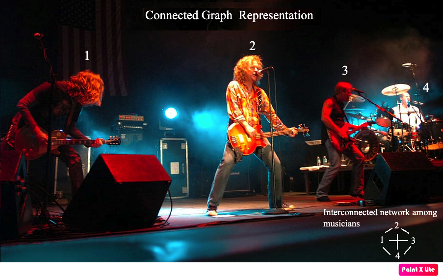
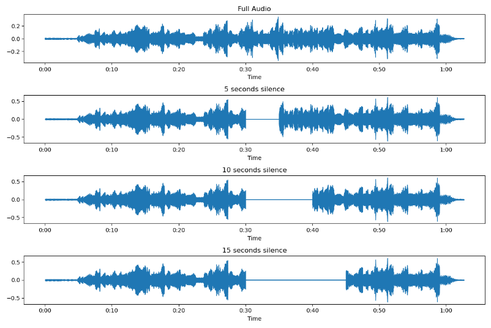
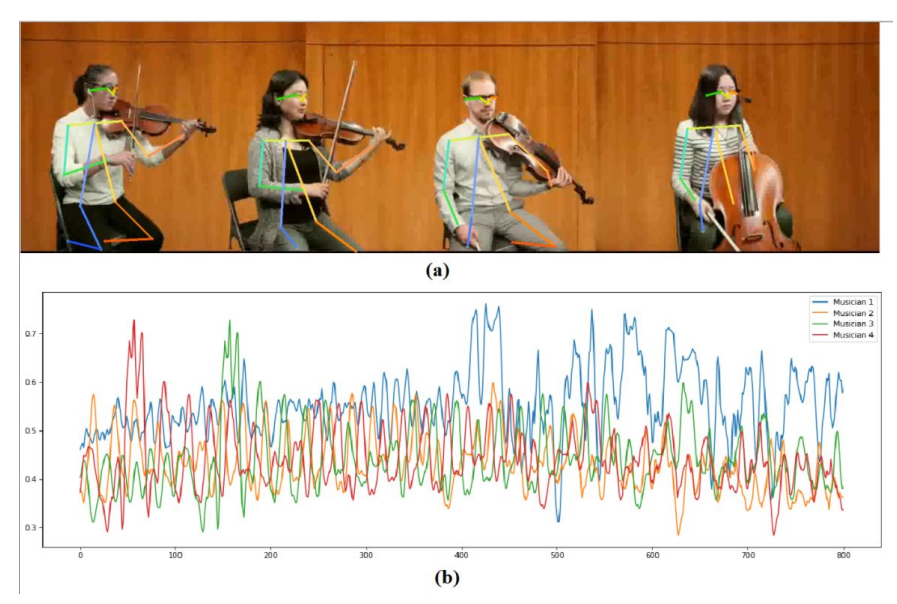
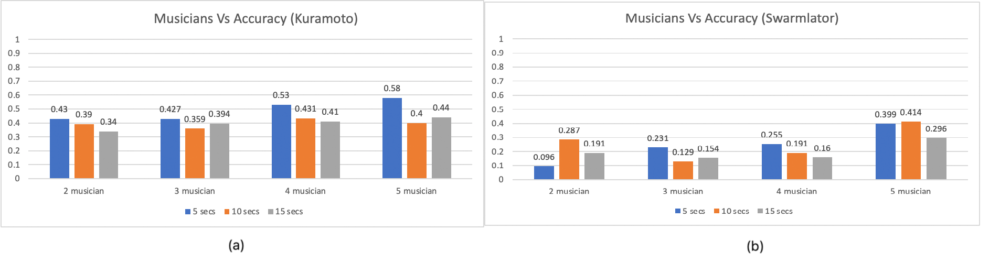

# Multimodal Synchronization in Musical Ensembles : Investigating Audio and Visual Cues
 

---

[Click here for more code details](Code_explaination.md)

## Abstract

  

Multimodal interaction, being a dynamic process, can be modeled as a set of coupled oscillators in certain situations with repetitive aspects, such as musical interfaces. Synchronization, a key metric of interactivity, refers to events occurring with reference to each other. This study investigates two mathematical models—Kuramoto and Swarmalator—used for musical phase synchronization amongst an ensemble. Each musician is represented as an individual oscillator communicating within a closely connected graph network.

  



  

The research assesses the dynamic response of these models to tempo changes, initially derived from audio feedback alone but then subsequently incorporating extra information via visual cues, such as body sway. The URMP dataset, featuring multimodal music performance data, is employed for the experiments.

  



  
  

Our results reveal that Kuramoto's model outperforms the Swarmalator approach in predicting the synchronization behavior of the ensemble for both the audio-only and audio-visual conditions, with the combined audio-visual approach yielding superior results.

  




  
  

Additionally, we observed that larger ensembles provided more visual sway information, leading to a higher mean accuracy in Kuramoto's results for the audio-visual model. These findings underscore the significance of considering both auditory and visual cues when studying musical phase synchronization in ensembles and suggest that Kuramoto's model presents a promising avenue for modeling synchronous behavior in more sophisticated group musical performances.



  
  
  

## How to run

First, install dependencies

```bash

# clone project

git clone  https://github.com/SutirthaChakraborty/Multimodal-Synchronization-in-Musical-Ensembles.git

  

# install project

cd  Multimodal-Synchronization-in-Musical-Ensembles

pip install  -e  .

pip install  -r  requirements.txt

```

Next, navigate to any file and run it.

```bash
# For offline using librosa beats
cd  Multimodal-Synchronization-in-Musical-Ensembles
python main_offline.py
```
```bash
# For realtime using Aubio beats
python main_realtime.py
```